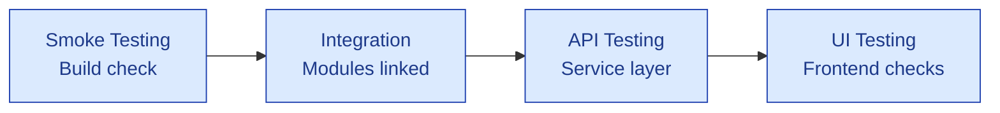
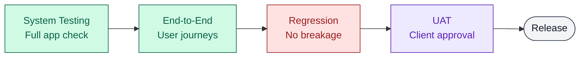

# 🎯 Testing Types Comparison Guide

> **Quick-Reference Companion to Part 2 (Types of Testing)**
> Difficulty Level: Beginner to Intermediate | Estimated Reading Time: 20 minutes

Part 2 teaches each testing type in depth, one at a time. This guide does the opposite job: it
puts eleven of the most-confused testing types **side by side** — Smoke, Sanity, Regression,
Retesting, System, Integration, End-to-End, UAT, API, UI, and Exploratory — so you can see at a
glance when each one runs, who owns it, what it's actually for, how it's done, and what it looks
like on a real project. Bookmark this one; it's built for skimming during an interview prep
session or a "wait, what's the difference between Sanity and Smoke again?" moment.

---

## 📋 Table of Contents

1. [The Comparison Table](#the-comparison-table)
2. [The Confusing Pairs, Untangled](#the-confusing-pairs-untangled)
3. [Recommended Execution Sequence](#recommended-execution-sequence)
4. [The Flow Diagram](#the-flow-diagram)
5. [The Frequency Pyramid](#the-frequency-pyramid)
6. [📌 Fact Sheet — 60-Second Version](#-fact-sheet--60-second-version)

---

## The Comparison Table

| Testing Type | When in the SDLC | Who Performs It | Purpose / Goal | How It's Executed | Real-World Examples (2, from portfolio repos) |
|---|---|---|---|---|---|
| **Smoke** | Immediately after a new build is deployed, *before* any deeper testing starts | QA (often automated as a CI gate); sometimes Dev/DevOps | Build acceptance — "is this build even stable enough to test?" | A short, shallow pass over the most critical paths only — login, homepage, core navigation | **1)** A reseller platform just deployed a new build — before anyone touches the regression suite, a tester spends five minutes confirming login works, the dashboard loads, and the merchant list actually renders. If any of those three fail, the build gets rejected on the spot. (<a href="https://github.com/ghanendra-sdet/reseller-management-platform" target="_blank" rel="noopener noreferrer">ref</a>)<br>**2)** On a bill payment platform, before anyone tests a single biller flow in depth, the smoke pass just confirms two things: does the biller category list load at all, and does one bill fetch actually succeed. Nothing deeper gets touched until those two boxes are checked. (<a href="https://github.com/ghanendra-sdet/bbps-bill-payment-platform" target="_blank" rel="noopener noreferrer">ref</a>) |
| **Sanity** | After a *specific* small fix or minor change, before committing to a full regression cycle | QA | Confirm one narrow area works after a targeted change — not "is the build stable," but "did *this* fix behave" | A focused, unscripted check around the changed area only, no test cases required | **1)** After a GST-rounding defect was fixed on a collection engine, the tester didn't re-run the whole suite — just sat the transaction detail screen and the CSV export side by side and compared the numbers. That's the entire sanity check. (<a href="https://github.com/ghanendra-sdet/fintech-collection-engine/blob/main/sample-defect-report.md" target="_blank" rel="noopener noreferrer">ref</a>)<br>**2)** An HRMS employee self-service form had a date-of-birth field that shouldn't have been editable after onboarding — once dev locked it, the sanity check was just opening that one field and confirming it was read-only, ignoring the other 13 fields on the same form. (<a href="https://github.com/ghanendra-sdet/hrms-platform/blob/main/sample-defect-report.md" target="_blank" rel="noopener noreferrer">ref</a>) |
| **Regression** | After *any* code change, before every release | QA (heavily automation-driven) | Prove existing functionality still works — nothing that used to pass has silently broken | Full or risk-prioritized re-run of the existing suite | **1)** A collection engine's release checklist runs 64 numbered test cases every single release, walking the full Login → Dashboard → Collection → Settlement → Reports chain — not because anything specific changed, but because anything could have. (<a href="https://github.com/ghanendra-sdet/fintech-collection-engine" target="_blank" rel="noopener noreferrer">ref</a>)<br>**2)** An HRMS self-service module re-verifies all 14 fields across its Personal and Contact Details forms on every release — even the 13 fields nobody touched this sprint — because regression's whole job is proving nothing quietly broke. (<a href="https://github.com/ghanendra-sdet/hrms-platform" target="_blank" rel="noopener noreferrer">ref</a>) |
| **Retesting** (Confirmation Testing) | Immediately after a specific defect is marked Fixed | QA — ideally the same tester who logged the original defect | Confirm *that exact bug* is gone — different question from regression, which asks "did I break something else" | Re-execute the *exact* steps to reproduce from the original defect report | **1)** A payout engine let a merchant's stuck IMPS retry fire twice, paying the beneficiary twice for one transfer. Once dev shipped a fix, retesting meant re-running that exact retry-after-timeout sequence, step for step, before the defect could move to Verified. (<a href="https://github.com/ghanendra-sdet/fintech-payout-engine/blob/main/sample-defect-report.md" target="_blank" rel="noopener noreferrer">ref</a>)<br>**2)** A claims platform showed a member's claim as "Final" while the payer's side still said "Need Review" — the same claim, two contradictory statuses. Retesting was narrow: reload that one claim in both portals side by side and confirm the statuses now agree, nothing else in the claims module. (<a href="https://github.com/ghanendra-sdet/healthcare-insurance-platform/blob/main/sample-defect-report.md" target="_blank" rel="noopener noreferrer">ref</a>) |
| **System** | After integration testing, on a complete, feature-frozen build | QA team, black-box | Validate the **entire system** end-to-end against requirements, as one product — not module by module | Full functional + non-functional suite executed against a near-production environment | **1)** A health insurance platform spans four separate portals — Provider, Payer, Employer, and Member — and before UAT sign-off, all four get tested together as one product, not four disconnected apps that happen to share a database. (<a href="https://github.com/ghanendra-sdet/healthcare-insurance-platform" target="_blank" rel="noopener noreferrer">ref</a>)<br>**2)** A travel marketplace only gets exposed to real third-party suppliers after it's proven itself as a whole product first — search, compare, lock a fare, book, and pay — all tested together, end to end, before any live supplier ever sees a request. (<a href="https://github.com/ghanendra-sdet/travel-marketplace-platform" target="_blank" rel="noopener noreferrer">ref</a>) |
| **Integration** | After unit testing, as soon as two or more modules/services are wired together | QA + Dev, often collaboratively | Verify the *interfaces* and data handoff between components — the seams, not the parts | Target the specific boundary between two services; verify data survives the handoff correctly | **1)** On a collection engine, the Settlement Calculation Service hands off to the Ledger Service — and that exact handoff is where a debit entry once silently went missing, breaking reconciliation. Integration testing means hammering precisely that seam, not the two services individually. (<a href="https://github.com/ghanendra-sdet/fintech-collection-engine/blob/main/sample-defect-report.md" target="_blank" rel="noopener noreferrer">ref</a>)<br>**2)** An AI dispute-resolution copilot reads data from six upstream products at once — Collection, Payout, Connected Banking, BBPS, Reseller, and an account-aggregator platform. Before the AI can correlate anything, integration testing has to prove each of those six handoffs arrives intact. (<a href="https://github.com/ghanendra-sdet/ai-dispute-resolution-engine" target="_blank" rel="noopener noreferrer">ref</a>) |
| **End-to-End (E2E)** | Late-stage, on a fully integrated build including real/near-real third-party dependencies | QA | Validate a complete real-world business journey across the *whole* system, not just internal modules | Simulate the full user journey start to finish, including external integrations | **1)** On a travel marketplace, end-to-end means running the full journey for real — search a flight, lock the fare, book it, pay for it — live against actual third-party supplier APIs, not stubs standing in for them. (<a href="https://github.com/ghanendra-sdet/travel-marketplace-platform" target="_blank" rel="noopener noreferrer">ref</a>)<br>**2)** On a bill payment platform, the chain runs discover-biller → fetch-bill → pay → settlement all the way through, hitting a real external biller integration on the far end instead of a mock — because a mock would never expose what an actual biller's quirks do to the flow. (<a href="https://github.com/ghanendra-sdet/bbps-bill-payment-platform" target="_blank" rel="noopener noreferrer">ref</a>) |
| **UAT** (User Acceptance Testing) | Final stage, right before release, in a staging/UAT environment | **Business stakeholders / actual end users** — QA facilitates but doesn't own the pass/fail call | Confirm the system actually meets business needs and is genuinely ready for real users | Business-scenario-based walkthroughs performed by the people who'll actually use it | **1)** Before an HRMS self-service module rolls out company-wide, it's real HR stakeholders — not QA — walking through the employee self-service flows and deciding whether it's actually ready for their staff to use. (<a href="https://github.com/ghanendra-sdet/hrms-platform" target="_blank" rel="noopener noreferrer">ref</a>)<br>**2)** On a health insurance platform, actual Payer- and Provider-side stakeholders walk through real claim scenarios before go-live — because only they can judge whether a claim's outcome actually matches how claims get adjudicated in the real world, not just whether the screen renders correctly. (<a href="https://github.com/ghanendra-sdet/healthcare-insurance-platform" target="_blank" rel="noopener noreferrer">ref</a>) |
| **API** | Can start before the UI even exists; continues through integration and system testing | QA / SDET | Validate business logic, data contracts, and status codes at the service layer, independent of any UI | Direct calls to endpoints (Postman, Playwright API requests) — status codes, response schemas, data correctness | **1)** A bill payment platform's discover-biller → fetch-bill → pay chain gets hit directly at the API layer, completely independent of the biller-selection screen — proving the logic works before the UI is even in the loop. (<a href="https://github.com/ghanendra-sdet/bbps-bill-payment-platform" target="_blank" rel="noopener noreferrer">ref</a>)<br>**2)** A collection engine's transaction-status, GST/commercial-calculation, and settlement endpoints all get validated against expected values directly — before the dashboard ever gets the chance to render a number that was wrong from the source. (<a href="https://github.com/ghanendra-sdet/fintech-collection-engine" target="_blank" rel="noopener noreferrer">ref</a>) |
| **UI** | Once a build is deployed to a testable environment; continues through system testing | QA | Validate look, layout, responsiveness, and UI-level functional correctness | Manual exploration plus scripted checks — layout, cross-device/cross-browser rendering, interaction correctness | **1)** On a travel marketplace, a fare shown on mobile has to match the same fare on desktop down to the exact figure — "close enough" isn't good enough when the number is what a customer's about to pay. (<a href="https://github.com/ghanendra-sdet/travel-marketplace-platform" target="_blank" rel="noopener noreferrer">ref</a>)<br>**2)** On an LMS, a course progress bar and a certificate preview both have to render correctly across screen sizes — a certificate that looks broken undermines the whole point of the product, since the certificate *is* the credential. (<a href="https://github.com/ghanendra-sdet/lms-platform" target="_blank" rel="noopener noreferrer">ref</a>) |
| **Exploratory** | Any stage — most valuable early (requirements are shaky) and for high-risk/complex areas | Experienced QA, unscripted | Uncover defects scripted test cases wouldn't think to check, via simultaneous learning + test design + execution | Time-boxed, charter-driven sessions (Session-Based Test Management) with real-time notes, not pre-written steps | **1)** On an AI dispute-resolution copilot, a chartered exploratory session goes hunting specifically for edge cases in the AI's recommendations — the kind of scenario no one would think to write a script for in advance. (<a href="https://github.com/ghanendra-sdet/ai-dispute-resolution-engine" target="_blank" rel="noopener noreferrer">ref</a>)<br>**2)** On a travel marketplace, an exploratory charter goes looking for third-party supplier flakiness on purpose — slow responses, stale prices, sessions that time out mid-booking — exactly the unpredictable conditions a fixed script could never anticipate. (<a href="https://github.com/ghanendra-sdet/travel-marketplace-platform" target="_blank" rel="noopener noreferrer">ref</a>) |

> [!TIP]
> **🎭 Meme Break — Distracted Boyfriend**
>
> 🚶 *The tester, walking with:* **"Running the full 64-case regression suite for the third time
> today"**
> 👀 *Looking back at:* **"That ONE exploratory session no one scheduled, that just found a
> Blocker in 20 minutes"**

---

## The Confusing Pairs, Untangled

Four pairs get mixed up constantly. Here's the one-line difference for each:

| Pair | The Mix-Up | The Actual Difference |
|---|---|---|
| **Smoke vs. Sanity** | "Aren't they both quick checks after a build?" | Smoke asks *"is this build stable enough to test at all?"* (broad, shallow, every build). Sanity asks *"did this one specific fix work?"* (narrow, deep, only after a targeted change). |
| **Sanity vs. Retesting** | "Aren't they both about a fix?" | Sanity checks the **area around** a change with no fixed script. Retesting re-runs the **exact original failing steps** from one specific defect report — nothing more, nothing less. |
| **System vs. Integration** | "Isn't the whole system just integrated modules?" | Integration testing checks the **seams** between two or three components. System testing checks the **entire product** as a black box, against requirements, after all the seams are already presumed sound. |
| **System vs. E2E** | "Isn't E2E just System testing renamed?" | System testing validates the product **on its own**. E2E testing validates a real business journey **including external, third-party dependencies** the product doesn't control (payment gateways, supplier APIs, SMS providers). |

<details>
<summary>🧠 <strong>Quick Check:</strong> A tester finds that after fixing BUG-COL-1078 (GST rounding), the fix works — but nobody re-ran the other 63 cases in the Collection Engine regression suite before release. What went wrong, and which two testing types does this expose the gap between?</summary>

The team did **Retesting** (confirmed BUG-COL-1078 itself was fixed) but skipped **Regression**
(confirming nothing *else* broke as a side effect of the fix). Retesting only ever answers "is
this one bug gone?" — it says nothing about whether the fix touched shared code (like a shared
GST-rounding function) that other flows also depend on. That's exactly why release checklists
require both: retest the specific fix, then regression-test the surrounding system.

</details>

---

## Recommended Execution Sequence

There's no single universal order — it depends on release cadence and risk — but this is the
sequence most real projects converge on, mapped against the SDLC:

1. **Smoke** — the moment a new build lands in a testable environment. If it fails, the build is
   rejected and nothing below this line even starts.
2. **Integration** — as soon as the relevant modules/services are wired together, tested at their
   boundaries.
3. **API** — runs in parallel with (often *before*) UI testing, since the service layer is
   frequently ready before the UI is.
4. **System** — once the build is feature-complete and integration-stable, tested as one product.
5. **UI** — woven through System testing: layout, responsiveness, and interaction correctness.
6. **Regression** — every time a change lands, re-validating what already worked.
7. **Sanity** — after each individual fix, before that fix is folded into the next regression run.
8. **Retesting** — immediately confirms each specific defect is actually closed.
9. **Exploratory** — runs continuously alongside all of the above, but gets a dedicated,
   time-boxed session before any major release — this is where scripted testing's blind spots
   get caught.
10. **End-to-End** — once the system is stable, validated against real (or near-real) third-party
    integrations.
11. **UAT** — the final gate. Business stakeholders, not QA, decide go/no-go here.

> [!TIP]
> **🎭 Meme Break — Expanding Brain**
>
> 🧠 *Level 1: "We'll just do regression testing at the end."*
> 🧠🧠 *Level 2: Running smoke tests on every build so broken builds get rejected in minutes, not
> days.*
> 🧠🧠🧠 *Level 3: Layering sanity + retesting + regression so each fix is both confirmed AND
> proven not to have broken anything else.*
> 🧠🧠🧠🧠 *Level 4: Booking a dedicated exploratory charter before every release, because the
> scripted suite — however good — only ever finds what it was written to look for.*

---

## The Flow Diagram

**Row 1 — while the build is stabilizing:**



> [!NOTE]
> **Sanity, Retesting, and Exploratory testing aren't a fixed stop on this line at all** — they
> run continuously, threaded through both rows, every single time a fix lands or a build moves
> forward.

**Row 2 — once the build is stable, through to release:**



Row 1 feeds directly into Row 2 (UI Testing passing means the build is ready for System Testing),
and Row 2 ends in the only two outcomes that matter: **UAT sign-off → Release**, or a defect that
sends the build back through Sanity → Retesting → Regression before it re-enters this line.

<details>
<summary>🧠 <strong>Quick Check:</strong> In the diagram above, why does the loop from "Bugs Found?" go through Sanity → Retesting → Regression — in that specific order — rather than straight back to System Testing?</summary>

Because each of those three answers a different, narrower question in increasing order of scope:
Sanity checks the area around the fix (fast, no script), Retesting proves *that exact defect* is
gone (using its original repro steps), and Regression proves the fix didn't break anything else
in the wider system. Skipping straight back to System Testing would waste time re-running
everything broad before confirming the fix even worked narrowly — cheaper checks come first.

</details>

---

## The Frequency Pyramid

Not every testing type runs equally often. Some run on *every single build* (many times a day);
others run once, right before release. Picturing this as a pyramid — frequent-and-shallow at the
top, rare-and-broad at the bottom — helps explain why teams automate the top of the pyramid first:

```
Frequency & Depth of Execution
═══════════════════════════════════════════════════════════════

Smoke            ████████████████████████████████  Every single build (minutes)
Sanity           ██████████████████████████████     After every targeted fix
Retesting        ████████████████████████████       After every defect closure
API              ████████████████████████           Continuously, often pre-UI
Integration      ██████████████████████              Every service boundary change
UI               ████████████████████                 Every UI-affecting build
Regression       ██████████████                         Every release candidate
Exploratory      ████████████                             Chartered sessions, pre-release
System           ████████                                    Feature-complete builds
End-to-End       ██████                                       Late-stage, pre-release
UAT              ██                                              Once, final gate
```

> [!IMPORTANT]
> **Read the pyramid as "how often," not "how important."** UAT sits at the bottom because it
> happens once — not because it matters least. A missed UAT sign-off blocks a release just as
> hard as a failed smoke test blocks a build. The shape explains automation priority (automate
> the top first, where the same checks repeat constantly) — it says nothing about severity.

---

## 📌 Fact Sheet — 60-Second Version

- **Smoke** = "is the build even worth testing?" **Sanity** = "did this one fix work?" Different
  questions, different scope, both fast and unscripted.
- **Retesting** re-runs one specific defect's original repro steps. **Regression** re-runs the
  broader suite to catch unrelated side effects. Do both, in that order, after every fix.
- **Integration** tests the seams between components. **System** tests the whole product as one
  black box. **End-to-End** adds real third-party dependencies the product doesn't control.
- **UAT is the only testing type in this table where QA doesn't make the pass/fail call** —
  business stakeholders do; QA facilitates.
- **API testing doesn't need a UI to exist** — it's often the earliest thing testable once a
  service is deployed, which is why mature teams start there.
- **Exploratory testing is unscripted by design** — its value is finding what a written test case
  wouldn't have thought to check, via chartered, time-boxed sessions (SBTM), not random clicking.
- The realistic execution order is **Smoke → Integration → API/System/UI → (Sanity → Retesting →
  Regression, looped per fix) → Exploratory → End-to-End → UAT** — not a strict waterfall, but
  the sequence most release cycles converge on.
- The **frequency pyramid** explains automation priority: automate what repeats constantly
  (Smoke, Sanity, Regression) before what happens once (UAT) — frequency, not importance, drives
  that order.
- Every real-world example on this page is drawn from an actual defect or checklist across this
  account's portfolio projects — cross-reference [Part 2](./Part_02_Types_of_Testing.md) for the
  full deep-dive on each type individually.

---

*Companion to [Part 2: Types of Testing](./Part_02_Types_of_Testing.md). Part of the
[Manual Testing Playbook](./00_Table_of_Contents.md).*
